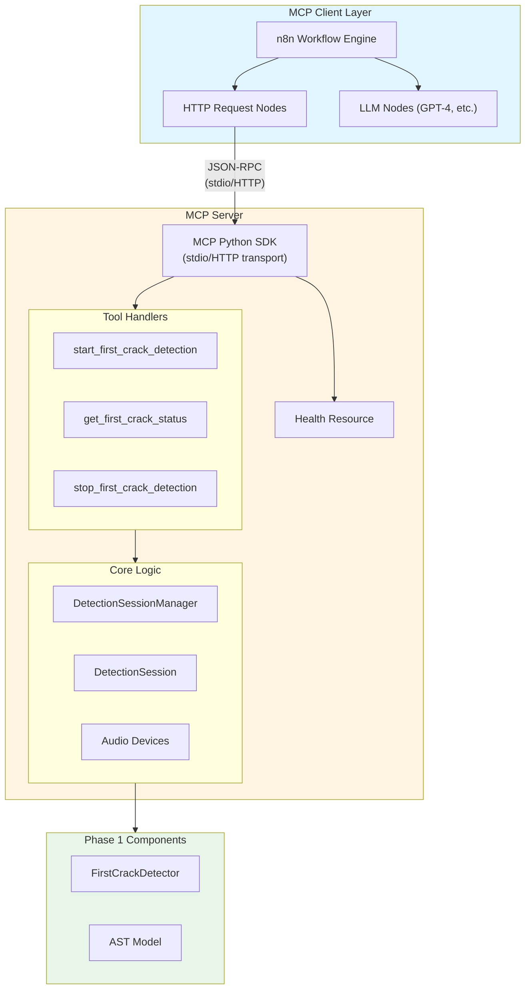
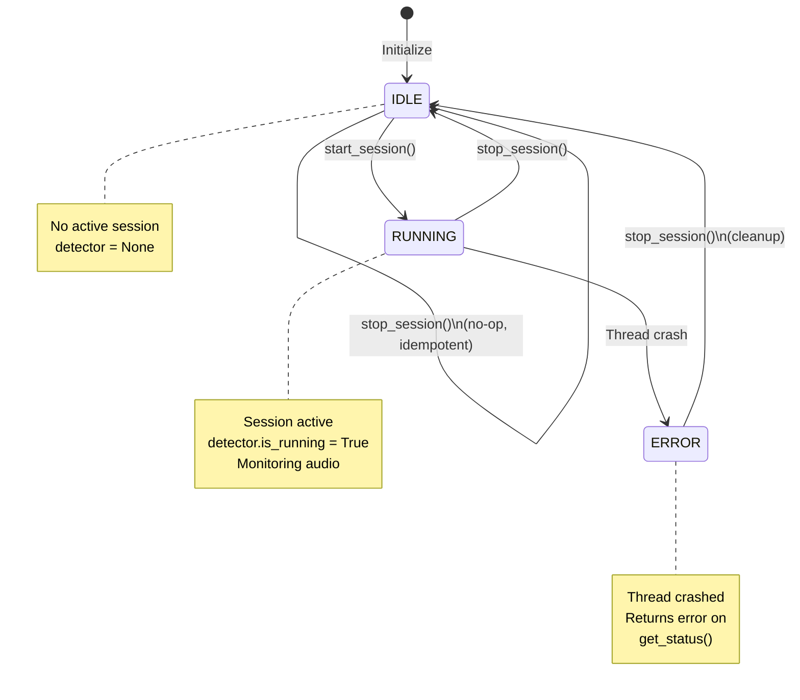
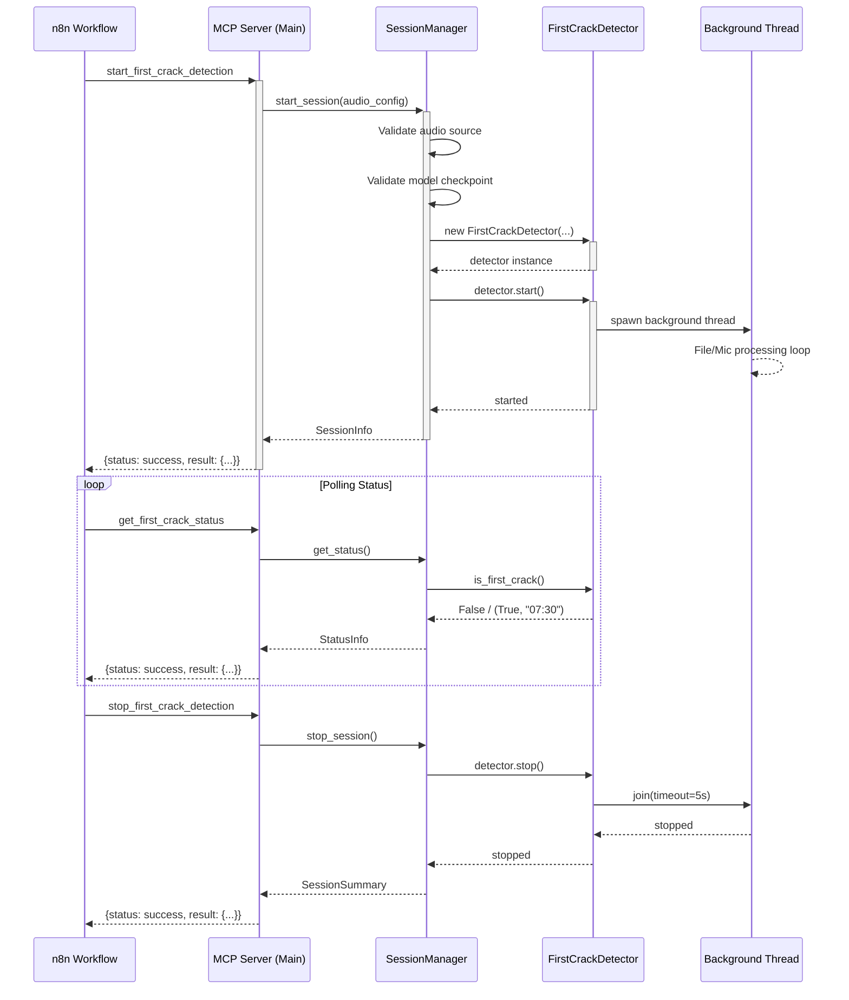
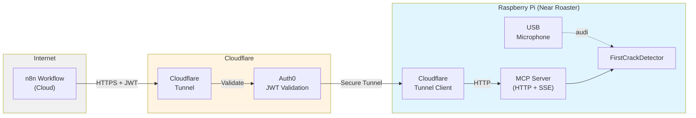

# Phase 2 Objective 1 - Design Document
## First Crack Detection MCP Server

**Status**: Design Approved  
**Last Updated**: 2025-01-25  
**Version**: 1.0

---

## Table of Contents

1. [Architecture Overview](#architecture-overview)
2. [Component Design](#component-design)
3. [Data Models](#data-models)
4. [Audio Device Management](#audio-device-management)
5. [Session Management](#session-management)
6. [Error Handling Strategy](#error-handling-strategy)
7. [Threading Model](#threading-model)
8. [Configuration](#configuration)
9. [Testing Strategy](#testing-strategy)

---

## Architecture Overview

### High-Level Architecture



### Component Stack (Text Summary)

**Layer 1: MCP Client (n8n)**
- HTTP request nodes
- LLM nodes for decision making
- Workflow orchestration

**Layer 2: MCP Server**
- Tool registry and handlers
- Three tools: start, get_status, stop
- Health resource

**Layer 3: Session Management**
- DetectionSessionManager (single session, thread-safe)
- DetectionSession (state holder)
- Audio device validation

**Layer 4: Inference (Phase 1)**
- FirstCrackDetector (background thread)
- AST model inference
- Pop confirmation logic
### Directory Structure

```
coffee-roasting/
├── src/
│   ├── inference/                           # Phase 1 (existing)
│   │   ├── __init__.py
│   │   └── first_crack_detector.py
│   ├── models/                              # Phase 1 (existing)
│   │   ├── __init__.py
│   │   ├── ast_model.py
│   │   └── config.py
│   ├── data_prep/                           # Phase 1 (existing)
│   │   └── ...
│   └── mcp_servers/                         # NEW - Phase 2
│       ├── __init__.py
│       ├── first_crack_detection/
│       │   ├── __init__.py
│       │   ├── server.py                    # Main MCP server entry point
│       │   ├── session_manager.py           # DetectionSessionManager
│       │   ├── models.py                    # Pydantic data models
│       │   ├── audio_devices.py             # Audio device discovery
│       │   ├── config.py                    # Configuration management
│       │   └── utils.py                     # Timezone, formatting utils
│       └── roaster_control/                 # Future - Objective 2
│           └── ...
├── tests/
│   ├── inference/                           # Phase 1 tests
│   ├── validation/                          # Phase 1 tests
│   └── mcp_servers/                         # NEW - Phase 2 tests
│       └── first_crack_detection/
│           ├── __init__.py
│           ├── unit/
│           │   ├── test_session_manager.py
│           │   ├── test_audio_devices.py
│           │   ├── test_models.py
│           │   ├── test_config.py
│           │   └── test_utils.py
│           └── integration/
│               └── test_mcp_integration.py
├── config/                                  # NEW - Configuration files
│   └── first_crack_detection/
│       ├── config.example.json
│       └── .env.example
├── docs/
│   ├── requirements/
│   ├── design/
│   ├── plans/
│   └── mcp_servers/                         # NEW - MCP server docs
│       └── first_crack_detection/
│           ├── README.md
│           └── DEPLOYMENT.md
└── requirements.txt                         # Root requirements (Phase 1)
```

---

## Component Design

### 1. MCP Server (`server.py`)

**Responsibilities**:
- Initialize MCP server instance using SDK
- Register tools and resources
- Route tool calls to handlers
- Handle server lifecycle (startup, shutdown)

**Key Functions**:
```python
async def main():
    """Main entry point for MCP server."""
    server = Server("first-crack-detection-server")
    
    # Register tools
    @server.tool()
    async def start_first_crack_detection(
        audio_source_type: str,
        audio_file_path: Optional[str] = None,
        detection_config: Optional[dict] = None
    ) -> dict:
        """Tool handler for starting detection."""
        return handle_start_detection(...)
    
    # ... other tools
    
    # Run server
    async with stdio_server() as (read_stream, write_stream):
        await server.run(read_stream, write_stream)
```

**Design Notes**:
- Use `mcp.server.Server` from SDK
- Async/await for SDK compatibility
- Tool decorators for registration
- Error handling wrapper for all handlers

---

### 2. DetectionSessionManager (`session_manager.py`)

**Responsibilities**:
- Manage single detection session lifecycle
- Enforce idempotency (start, stop)
- Monitor thread health
- Coordinate timezone conversions

**Class Structure**:
```python
class DetectionSessionManager:
    """Manages the single detection session."""
    
    def __init__(self, config: ServerConfig):
        self._session: Optional[DetectionSession] = None
        self._lock = threading.Lock()
        self._config = config
    
    def start_session(
        self,
        audio_config: AudioConfig
    ) -> SessionInfo:
        """Start detection session (idempotent)."""
        with self._lock:
            if self._session is not None:
                # Already running
                return self._get_session_info(already_running=True)
            
            # Validate audio source
            self._validate_audio_source(audio_config)
            
            # Validate model checkpoint
            self._validate_model_checkpoint()
            
            # Create detector
            detector = self._create_detector(audio_config)
            
            # Create session
            self._session = DetectionSession(
                session_id=str(uuid.uuid4()),
                detector=detector,
                started_at=datetime.now(timezone.utc),
                audio_config=audio_config
            )
            
            # Start detector
            try:
                detector.start()
            except Exception as e:
                self._session = None
                raise DetectionError(f"Failed to start detector: {e}")
            
            return self._get_session_info(already_running=False)
    
    def get_status(self) -> StatusInfo:
        """Get current status (with thread health check)."""
        with self._lock:
            if self._session is None:
                return StatusInfo(session_active=False)
            
            # Check thread health
            if not self._session.detector.is_running:
                # Thread crashed or stopped
                if self._session.thread_exception:
                    raise ThreadCrashError(self._session.thread_exception)
            
            # Get detection result
            result = self._session.detector.is_first_crack()
            
            return self._build_status_info(result)
    
    def stop_session(self) -> SessionSummary:
        """Stop session (idempotent)."""
        with self._lock:
            if self._session is None:
                return SessionSummary(session_state="no_active_session")
            
            session = self._session
            self._session = None
            
            # Stop detector
            session.detector.stop()
            
            # Build summary
            return self._build_session_summary(session)
    
    # Private helpers
    def _validate_audio_source(self, config: AudioConfig):
        """Validate audio source is available."""
        # Implementation in Audio Devices section
    
    def _validate_model_checkpoint(self):
        """Validate model checkpoint exists."""
        if not Path(self._config.model_checkpoint).exists():
            raise ModelNotFoundError(
                f"Model checkpoint not found: {self._config.model_checkpoint}"
            )
```

**Design Decisions**:
- **Thread safety**: Use lock for all session operations
- **Single session**: `_session` is None or DetectionSession
- **Idempotency**: Check session state before actions
- **Validation**: Fast-fail on preconditions

---

### 3. Audio Device Management (`audio_devices.py`)

**Responsibilities**:
- Discover available audio devices
- Differentiate USB vs built-in microphones
- Provide device selection logic

**Key Functions**:
```python
import sounddevice as sd
from typing import Optional, List, Dict

def list_audio_devices() -> List[Dict[str, any]]:
    """List all available audio input devices."""
    devices = sd.query_devices()
    input_devices = [
        {
            "index": i,
            "name": dev["name"],
            "channels": dev["max_input_channels"],
            "default": i == sd.default.device[0]
        }
        for i, dev in enumerate(devices)
        if dev["max_input_channels"] > 0
    ]
    return input_devices

def find_usb_microphone() -> Optional[int]:
    """Find first USB audio input device."""
    devices = list_audio_devices()
    
    # Heuristic: USB devices often have "USB" in name
    for dev in devices:
        name_lower = dev["name"].lower()
        if "usb" in name_lower and not dev["default"]:
            return dev["index"]
    
    return None

def find_builtin_microphone() -> Optional[int]:
    """Find built-in (default) microphone."""
    try:
        default_input = sd.default.device[0]
        return default_input
    except Exception:
        return None

def get_device_info(device_index: int) -> Dict[str, any]:
    """Get detailed device information."""
    return sd.query_devices(device_index)

def validate_audio_source(config: AudioConfig) -> Tuple[bool, str]:
    """
    Validate audio source is available.
    
    Returns:
        (is_valid, device_name_or_error)
    """
    if config.audio_source_type == "audio_file":
        if not Path(config.audio_file_path).exists():
            return False, f"File not found: {config.audio_file_path}"
        return True, config.audio_file_path
    
    elif config.audio_source_type == "usb_microphone":
        device_index = find_usb_microphone()
        if device_index is None:
            return False, "No USB microphone found"
        device_info = get_device_info(device_index)
        return True, device_info["name"]
    
    elif config.audio_source_type == "builtin_microphone":
        device_index = find_builtin_microphone()
        if device_index is None:
            return False, "No built-in microphone found"
        device_info = get_device_info(device_index)
        return True, device_info["name"]
    
    else:
        return False, f"Invalid audio source type: {config.audio_source_type}"
```

**Design Notes**:
- Use `sounddevice` library for cross-platform device enumeration
- USB detection heuristic: name contains "USB"
- Built-in detection: use system default input device
- Validation returns helpful error messages

---

## Data Models

### Pydantic Models (`models.py`)

```python
from pydantic import BaseModel, Field, validator
from typing import Optional, Literal
from datetime import datetime

class AudioConfig(BaseModel):
    """Audio source configuration."""
    audio_source_type: Literal["audio_file", "usb_microphone", "builtin_microphone"]
    audio_file_path: Optional[str] = None
    
    @validator("audio_file_path")
    def validate_file_path(cls, v, values):
        if values.get("audio_source_type") == "audio_file" and not v:
            raise ValueError("audio_file_path required when audio_source_type is 'audio_file'")
        return v

class DetectionConfig(BaseModel):
    """Detection parameters."""
    threshold: float = Field(default=0.5, ge=0.0, le=1.0)
    min_pops: int = Field(default=3, ge=1)
    confirmation_window: float = Field(default=30.0, ge=1.0)

class SessionInfo(BaseModel):
    """Information about started session."""
    session_state: Literal["started", "already_running"]
    session_id: str
    started_at_utc: datetime
    started_at_local: datetime
    audio_source: str
    audio_source_details: str

class StatusInfo(BaseModel):
    """Current detection status."""
    session_active: bool
    session_id: Optional[str] = None
    elapsed_time: Optional[str] = None  # MM:SS
    first_crack_detected: bool = False
    first_crack_time_relative: Optional[str] = None  # MM:SS
    first_crack_time_utc: Optional[datetime] = None
    first_crack_time_local: Optional[datetime] = None
    confidence: Optional[dict] = None  # {"pop_count": N, "confirmation_window": X}
    started_at_utc: Optional[datetime] = None
    started_at_local: Optional[datetime] = None
    audio_source: Optional[str] = None

class SessionSummary(BaseModel):
    """Summary after session stop."""
    session_state: Literal["stopped", "no_active_session"]
    session_id: Optional[str] = None
    session_summary: Optional[dict] = None

class ServerConfig(BaseModel):
    """Server configuration."""
    model_checkpoint: str
    default_threshold: float = 0.5
    default_min_pops: int = 3
    default_confirmation_window: float = 30.0
    log_level: str = "INFO"
```

---

## Session Management

### DetectionSession State Object

```python
@dataclass
class DetectionSession:
    """Represents an active detection session."""
    session_id: str
    detector: FirstCrackDetector
    started_at: datetime
    audio_config: AudioConfig
    thread_exception: Optional[Exception] = None
    windows_processed: int = 0
```

### State Transitions



### Thread Health Monitoring

The session manager monitors thread health by:
1. Checking `detector.is_running` property
2. Catching exceptions from `detector._thread`
3. Storing exception in `session.thread_exception`
4. Raising `ThreadCrashError` on next `get_status()` call

---

## Error Handling Strategy

### Error Hierarchy

```python
class DetectionError(Exception):
    """Base exception for detection errors."""
    pass

class ModelNotFoundError(DetectionError):
    """Model checkpoint not found."""
    error_code = "MODEL_NOT_FOUND"

class MicrophoneNotAvailableError(DetectionError):
    """Microphone device not available."""
    error_code = "MICROPHONE_NOT_AVAILABLE"

class FileNotFoundError(DetectionError):
    """Audio file not found."""
    error_code = "FILE_NOT_FOUND"

class SessionAlreadyActiveError(DetectionError):
    """Cannot start session, one already active."""
    error_code = "SESSION_ALREADY_ACTIVE"

class ThreadCrashError(DetectionError):
    """Detection thread crashed."""
    error_code = "DETECTION_THREAD_CRASHED"

class InvalidAudioSourceError(DetectionError):
    """Invalid audio source type."""
    error_code = "INVALID_AUDIO_SOURCE"
```

### Error Response Format

All tool handlers wrap exceptions:

```python
def handle_tool_call(func):
    """Decorator to standardize error responses."""
    def wrapper(*args, **kwargs):
        try:
            result = func(*args, **kwargs)
            return {"status": "success", "result": result}
        except DetectionError as e:
            return {
                "status": "error",
                "error": {
                    "code": e.error_code,
                    "message": str(e),
                    "details": e.details if hasattr(e, "details") else {}
                }
            }
        except Exception as e:
            # Unexpected error
            return {
                "status": "error",
                "error": {
                    "code": "INTERNAL_ERROR",
                    "message": f"Unexpected error: {str(e)}",
                    "details": {}
                }
            }
    return wrapper
```

---

## Threading Model

### Thread Safety Considerations

1. **DetectionSessionManager**: All methods use `self._lock` (threading.Lock)
2. **FirstCrackDetector**: Already thread-safe (uses internal lock)
3. **MCP Server**: SDK handles async event loop (no manual thread management)

### Thread Lifecycle



---

## Configuration

### Server Configuration File (`config.json`)

```json
{
  "model_checkpoint": "/path/to/experiments/final_model/model.pt",
  "detection_defaults": {
    "threshold": 0.5,
    "min_pops": 3,
    "confirmation_window": 30.0
  },
  "audio": {
    "sample_rate": 16000,
    "window_size": 10.0,
    "overlap": 0.7
  },
  "logging": {
    "level": "INFO",
    "format": "json"
  }
}
```

### Environment Variables

```bash
# Optional overrides
FIRST_CRACK_MODEL_CHECKPOINT=/path/to/model.pt
FIRST_CRACK_LOG_LEVEL=DEBUG
```

---

## Testing Strategy

### Unit Tests

1. **DetectionSessionManager**:
   - Start session (success, idempotent, errors)
   - Get status (no session, active, detected, crashed)
   - Stop session (success, idempotent)

2. **Audio Devices**:
   - Device enumeration
   - USB detection
   - Built-in detection
   - Validation logic

3. **Data Models**:
   - Pydantic validation
   - Serialization/deserialization

### Integration Tests

1. **MCP Tool Calls**:
   - Start → Status → Stop (file input)
   - Start → Status → Stop (mock microphone)
   - Error scenarios (model missing, no mic)
   - Thread crash simulation

2. **End-to-End**:
   - Full session with real audio file
   - First crack detection verification

### Test Fixtures

```python
@pytest.fixture
def mock_detector():
    """Mock FirstCrackDetector for testing."""
    detector = MagicMock(spec=FirstCrackDetector)
    detector.is_running = True
    detector.is_first_crack.return_value = False
    return detector

@pytest.fixture
def test_config():
    """Test server configuration."""
    return ServerConfig(
        model_checkpoint="tests/fixtures/mock_model.pt",
        log_level="DEBUG"
    )
```

---

## Implementation Notes

### Timezone Handling

```python
from datetime import datetime, timezone
from zoneinfo import ZoneInfo

def get_local_timezone():
    """Get system local timezone."""
    # On MacOS, defaults to system timezone
    return ZoneInfo(time.tzname[0])

def to_local_time(utc_dt: datetime) -> datetime:
    """Convert UTC datetime to local timezone."""
    return utc_dt.astimezone(get_local_timezone())

def format_elapsed_time(seconds: float) -> str:
    """Format seconds as MM:SS."""
    total_seconds = int(seconds)
    minutes = total_seconds // 60
    secs = total_seconds % 60
    return f"{minutes:02d}:{secs:02d}"
```

### Logging

Use structured logging (JSON format) for agent parsability:

```python
import logging
import json

class JSONFormatter(logging.Formatter):
    def format(self, record):
        log_data = {
            "timestamp": datetime.utcnow().isoformat(),
            "level": record.levelname,
            "message": record.getMessage(),
            "module": record.module,
            "function": record.funcName
        }
        if record.exc_info:
            log_data["exception"] = self.formatException(record.exc_info)
        return json.dumps(log_data)
```

---

## Future Enhancements (Phase 3)

### Production Deployment

- HTTP + SSE transport for remote access
- Cloudflare tunnel for secure internet exposure
- Auth0 JWT authentication
- Role-based access control (Admin/Observer)
- Raspberry Pi deployment (near roaster)

### Deployment Architecture



### Additional Features

- Persistent session history (optional)
- Metrics and monitoring endpoints
- WebSocket support for real-time updates (optional)

---

## References

- [MCP Python SDK Documentation](https://github.com/modelcontextprotocol/python-sdk)
- [MCP Specification](https://spec.modelcontextprotocol.io/)
- [FirstCrackDetector Implementation](../../src/inference/first_crack_detector.py)
- [Phase 2 Objective 1 Requirements](../requirements/phase-2-objective-1-requirements.md)
