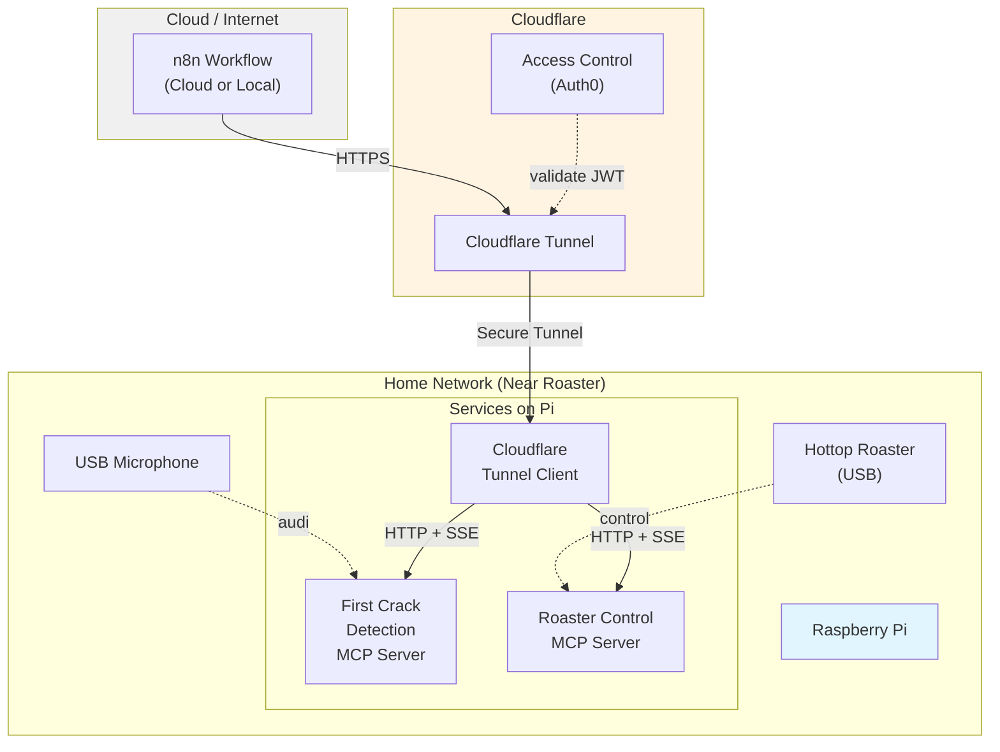

# Phase 2 Objective 1 - First Crack Detection MCP Server

**Status**: Requirements Finalized  
**Last Updated**: 2025-01-25  
**Owner**: Coffee Roasting Project

---

## Overview

Build an MCP server that wraps the existing FirstCrackDetector inference pipeline, exposing it as standardized MCP tools for agent integration.

### Scope & Constraints

- **Single session only**: One detection session at a time (1:1 with roaster)
- **No persistence**: All state in-memory; agent handles data aggregation
- **Simple lifecycle**: Agent controls start/stop; no auto-cleanup/timeout logic
- **Local deployment**: Initially stdio transport for development
- **Production deployment**: HTTP + SSE transport via Cloudflare tunnel (Phase 3)
- **Hardware target**: MacOS (M3 Max) → future Raspberry Pi migration (near roaster)
- **Orchestrator**: n8n workflow engine

---

## MCP Tools Specification

### Tool 1: `start_first_crack_detection`

**Description**: Starts first crack monitoring with specified audio source.

**Input Schema**:
```json
{
  "audio_source_type": "audio_file" | "usb_microphone" | "builtin_microphone",
  "audio_file_path": "string (required if audio_source_type=audio_file)",
  "detection_config": {
    "threshold": 0.5,              // optional, default 0.5
    "min_pops": 3,                 // optional, default 3
    "confirmation_window": 30.0    // optional, default 30.0s
  }
}
```

**Returns (Success)**:
```json
{
  "status": "success",
  "result": {
    "session_state": "started" | "already_running",
    "session_id": "uuid",
    "started_at_utc": "2025-01-25T15:30:00Z",
    "started_at_local": "2025-01-25T10:30:00-05:00",
    "audio_source": "audio_file | usb_microphone | builtin_microphone",
    "audio_source_details": "string (e.g., device name or file path)"
  }
}
```

**Returns (Error)**:
```json
{
  "status": "error",
  "error": {
    "code": "MODEL_NOT_FOUND" | "MICROPHONE_NOT_AVAILABLE" | "FILE_NOT_FOUND" | "SESSION_ALREADY_ACTIVE",
    "message": "Human-readable error message",
    "details": {
      // Additional context for agent
    }
  }
}
```

**Behavior**:
- **Idempotent**: If session already running, returns existing session with `session_state: "already_running"`
- **Auto-detection**: For USB mic, automatically finds first available USB audio device
- **Error immediately**: If model/audio source unavailable, fails fast before starting thread

**Authorization**: Requires `write:detection` permission (Phase 3).

---

### Tool 2: `get_first_crack_status`

**Description**: Query current detection state.

**Input Schema**: None (empty object `{}`)

**Returns (Success - Active Session)**:
```json
{
  "status": "success",
  "result": {
    "session_active": true,
    "session_id": "uuid",
    "elapsed_time": "08:45",  // MM:SS from start
    "first_crack_detected": false,
    "started_at_utc": "2025-01-25T15:30:00Z",
    "started_at_local": "2025-01-25T10:30:00-05:00",
    "audio_source": "usb_microphone"
  }
}
```

**Returns (Success - First Crack Detected)**:
```json
{
  "status": "success",
  "result": {
    "session_active": true,
    "session_id": "uuid",
    "elapsed_time": "08:45",
    "first_crack_detected": true,
    "first_crack_time_relative": "07:30",  // MM:SS from start
    "first_crack_time_utc": "2025-01-25T15:37:30Z",
    "first_crack_time_local": "2025-01-25T10:37:30-05:00",
    "confidence": {
      "pop_count": 5,
      "confirmation_window": 30.0
    },
    "started_at_utc": "2025-01-25T15:30:00Z",
    "started_at_local": "2025-01-25T10:30:00-05:00",
    "audio_source": "usb_microphone"
  }
}
```

**Returns (Success - No Active Session)**:
```json
{
  "status": "success",
  "result": {
    "session_active": false,
    "message": "No active detection session"
  }
}
```

**Returns (Error - Thread Crashed)**:
```json
{
  "status": "error",
  "error": {
    "code": "DETECTION_THREAD_CRASHED",
    "message": "Detection thread terminated unexpectedly",
    "details": {
      "session_id": "uuid",
      "crash_time": "2025-01-25T15:35:00Z",
      "error_message": "Exception details"
    }
  }
}
```

**Behavior**:
- Returns current state snapshot
- Detects and reports thread crashes
- Lightweight (no blocking operations)

**Authorization**: Requires `read:detection` permission (Phase 3).

---

### Tool 3: `stop_first_crack_detection`

**Description**: Stops monitoring and cleans up resources.

**Input Schema**: None (empty object `{}`)

**Returns (Success)**:
```json
{
  "status": "success",
  "result": {
    "session_state": "stopped",
    "session_id": "uuid",
    "session_summary": {
      "duration": "10:23",  // MM:SS
      "first_crack_detected": true,
      "first_crack_time_relative": "07:30",
      "first_crack_time_local": "2025-01-25T10:37:30-05:00",
      "total_windows_processed": 123
    }
  }
}
```

**Returns (Success - No Session)**:
```json
{
  "status": "success",
  "result": {
    "session_state": "no_active_session",
    "message": "No active session to stop"
  }
}
```

**Behavior**:
- Graceful shutdown (thread join with timeout)
- Returns final summary
- Idempotent (safe to call multiple times)

**Authorization**: Requires `write:detection` permission (Phase 3).

---

## Additional Endpoints

### Health Check: `health` (MCP built-in resource)

**Description**: Server health and readiness status.

**Returns**:
```json
{
  "status": "healthy",
  "model_loaded": true,
  "model_checkpoint": "/path/to/model.pt",
  "device": "mps",
  "version": "1.0.0"
}
```

---

## Error Codes Reference

| Code | Scenario | Resolution |
|------|----------|------------|
| `MODEL_NOT_FOUND` | Model checkpoint missing | Verify checkpoint path in config |
| `MICROPHONE_NOT_AVAILABLE` | USB/builtin mic not found | Check hardware, try different source |
| `FILE_NOT_FOUND` | Audio file doesn't exist | Verify file path |
| `SESSION_ALREADY_ACTIVE` | Start called with active session | Call stop first, or use existing session |
| `DETECTION_THREAD_CRASHED` | Background thread failed | Check logs, restart server |
| `INVALID_AUDIO_SOURCE` | Unknown audio_source_type | Use valid type |

---

## Audio Source Configuration

### 1. Audio File
```json
{
  "audio_source_type": "audio_file",
  "audio_file_path": "/path/to/roast-recording.wav"
}
```
- Supported formats: WAV (16-bit, mono/stereo)
- Sample rate: Auto-resampled to 16kHz
- Duration: Any length

### 2. USB Microphone (Primary)
```json
{
  "audio_source_type": "usb_microphone"
}
```
- Auto-detects first USB audio input device
- Falls back to built-in if no USB found? **No** - errors out
- Sample rate: 16kHz

### 3. Built-in Microphone (Fallback)
```json
{
  "audio_source_type": "builtin_microphone"
}
```
- Uses MacOS default audio input
- Sample rate: 16kHz
- Lowest priority (agent decision)

---

## Technical Architecture

### Protocol & Transport

**Phase 2 (Current - Development)**: 
- **Protocol**: MCP (JSON-RPC 2.0)
- **Transport**: stdio (local process)
- **SDK**: [MCP Python SDK](https://github.com/modelcontextprotocol/python-sdk)
- **Client**: n8n workflow (local testing)
- **Auth**: Local trust (no auth required)

**Phase 3 (Production - Remote Access)**:
- **Transport**: HTTP + SSE (remote access over internet)
- **Deployment**: Cloudflare tunnel from Raspberry Pi (near roaster) to internet
- **Client**: n8n workflow (cloud-hosted or remote)
- **Auth**: Auth0 JWT with role-based access control
- **Roles**: Roast Admin (write), Roast Observer (read)

### Component Stack

```
┌─────────────────────────────────────────┐
│  MCP Client (n8n Workflow)              │
│  - HTTP nodes for tool calls            │
│  - LLM nodes for decision making        │
└──────────────┬──────────────────────────┘
               │ stdio (Phase 2) / HTTP (Phase 3)
               ▼
┌─────────────────────────────────────────┐
│  MCP Server (Python SDK)                │
│  ┌───────────────────────────────────┐  │
│  │  Tool Handlers                    │  │
│  │  - start_first_crack_detection    │  │
│  │  - get_first_crack_status         │  │
│  │  - stop_first_crack_detection     │  │
│  └───────────────────────────────────┘  │
│  ┌───────────────────────────────────┐  │
│  │  DetectionSessionManager          │  │
│  │  - Single session state           │  │
│  │  - Idempotency + lifecycle        │  │
│  │  - Timezone conversions           │  │
│  │  - Thread health monitoring       │  │
│  └───────────────────────────────────┘  │
│  ┌───────────────────────────────────┐  │
│  │  FirstCrackDetector (existing)    │  │
│  │  - Threading + sliding window     │  │
│  │  - Model inference (AST)          │  │
│  └───────────────────────────────────┘  │
└─────────────────────────────────────────┘
```

### Dependencies

**New**:
- `mcp` - MCP Python SDK
- `python-dateutil` - Timezone handling

**Existing** (from Phase 1):
- `torch`, `transformers` - Model inference
- `librosa`, `sounddevice` - Audio processing
- `numpy` - Array operations

---

## Design Decisions

### ✅ Single Session Model
**Rationale**: 1:1 mapping with physical roaster; simplifies state management.

### ✅ In-Memory State Only
**Rationale**: Agent aggregates data; server focuses on real-time detection.

### ✅ Agent-Controlled Lifecycle
**Rationale**: No server-side timeouts/cleanup; agent decides when to stop.

### ✅ MCP Protocol (stdio transport)
**Rationale**: 
- Standard protocol for LLM tool integration
- Local trust boundary (no HTTP auth complexity initially)
- Better Claude Desktop integration
- Simpler than custom HTTP API

### ✅ Three Audio Source Types
**Rationale**: Explicit control for agent; USB preferred, built-in as fallback.

### ✅ Fast-Fail Error Handling
**Rationale**: Validate preconditions (model, audio) before starting thread.

### ✅ Thread Health Monitoring
**Rationale**: Detect crashes during execution; return errors in status calls.

---

## Non-Functional Requirements

### Performance
- **Detection latency**: <2s (inherited from Phase 1 model)
- **Status query**: <50ms response time
- **Thread overhead**: Minimal CPU when idle (sliding window only)

### Reliability
- **Graceful degradation**: Return errors vs crashes
- **Thread safety**: Proper locking for state access
- **Clean shutdown**: 5s timeout for thread join

### Observability
- **Logging**: Structured logs (JSON) for events, errors
- **Health endpoint**: Model status, device info
- **Session tracking**: UUID for correlation

---

## Out of Scope (Phase 2)

**Deferred to Phase 3 (Production Deployment)**:
- ❌ HTTP + SSE transport (will use stdio in Phase 2)
- ❌ Cloudflare tunnel configuration
- ❌ Auth0 JWT authentication
- ❌ Role-based access control enforcement
- ❌ SSL/TLS certificate management
- ❌ Production monitoring & alerting

**Not Planned (Any Phase)**:
- ❌ Multiple concurrent sessions
- ❌ Persistent storage / database
- ❌ Distributed deployment (multiple roasters)
- ❌ Real-time streaming dashboard
- ❌ Audio recording/playback features

---

## Success Criteria

✅ MCP server starts and registers tools  
✅ Can start detection with file/USB mic/built-in mic  
✅ Returns detection status with UTC + local timestamps  
✅ Handles errors gracefully (model missing, mic unavailable, thread crash)  
✅ Idempotent operations (start, stop)  
✅ Integrates with existing FirstCrackDetector  
✅ Works with n8n workflow via stdio (Phase 2)  
✅ Health check returns model status  
✅ Architecture ready for HTTP + Cloudflare tunnel migration (Phase 3)
✅ Documentation complete (API spec, deployment guide)  

---

---

## Phase 3 Deployment Architecture (Future)

### Production Setup Overview



### Key Components

**Raspberry Pi (Near Roaster)**:
- Hosts both MCP servers
- Connected to USB microphone and roaster
- Runs Cloudflare tunnel client
- Local network only (no port forwarding)

**Cloudflare Tunnel**:
- Secure outbound connection from Pi to Cloudflare
- No inbound firewall rules required
- Zero Trust access control
- Free tier available

**n8n Workflow**:
- Cloud-hosted or separate local machine
- Makes HTTPS requests to tunnel endpoint
- Includes Auth0 JWT in requests
- Orchestrates roasting logic with LLM

**Auth0**:
- JWT token generation for n8n
- Role-based access control (Admin/Observer)
- Token validation at Cloudflare edge

### Benefits

- ✅ No exposed ports on home network
- ✅ Secure encrypted tunnel
- ✅ Access from anywhere (cloud n8n)
- ✅ Standard HTTPS (no custom protocols)
- ✅ Auth0 integration for security

### Phase 3 Migration Path

1. Add HTTP + SSE transport to MCP servers (SDK supports this)
2. Deploy to Raspberry Pi near roaster
3. Configure Cloudflare tunnel
4. Set up Auth0 application and API
5. Update n8n workflows to use HTTPS endpoints
6. Test end-to-end with authentication

---

## References

- [MCP Specification](https://spec.modelcontextprotocol.io/)
- [MCP Python SDK](https://github.com/modelcontextprotocol/python-sdk)
- [Cloudflare Tunnels Documentation](https://developers.cloudflare.com/cloudflare-one/connections/connect-apps/)
- [Auth0 Documentation](https://auth0.com/docs)
- [Phase 1 Complete](../../PHASE1_COMPLETE.md)
- [FirstCrackDetector Implementation](../../src/inference/first_crack_detector.py)
- [Phase 2 Overview](./phase-2.md)
